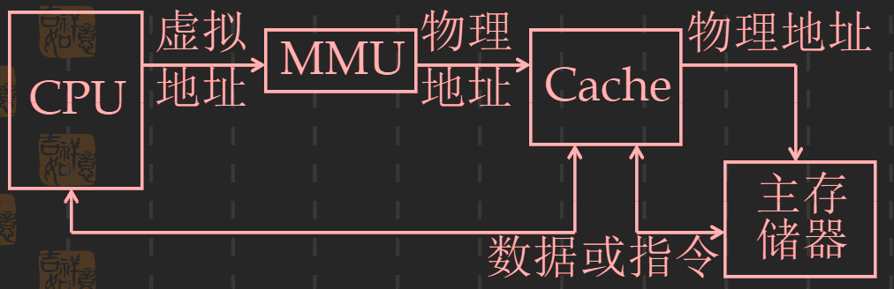
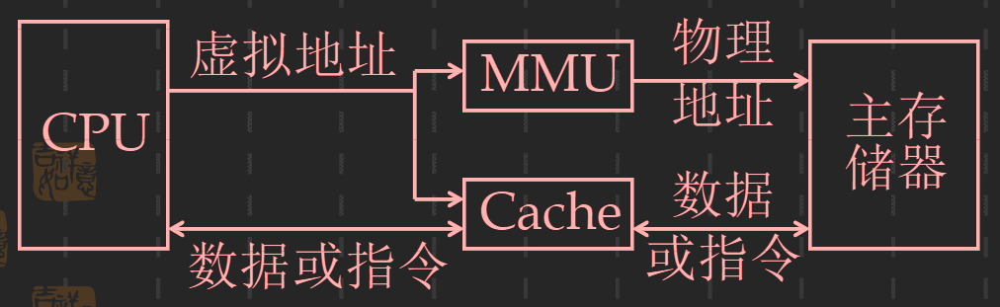

## 三级存储系统
1. 两个存储系统组织方式
   - Cache<->主存 和 主存<->磁盘

   

   _MMU是存储管理部件_
2. 一个存储系统组织方式
   - Cache<->主存<->磁盘

    
3. 全Cache系统
   - Cache<->磁盘
### 1. 虚拟地址Cache
    课本P200
### 2. 全Cache技术
    还在实验阶段，并未商用；课本 P201