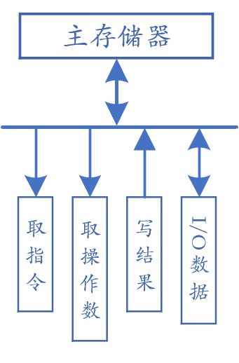
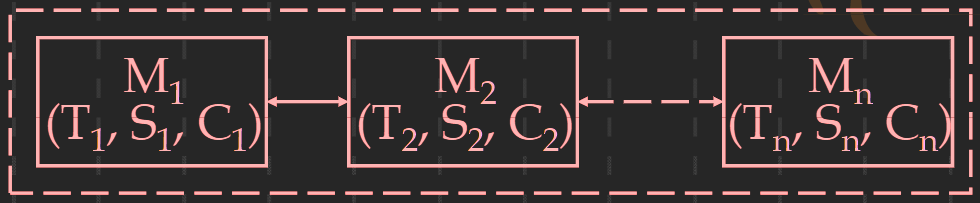
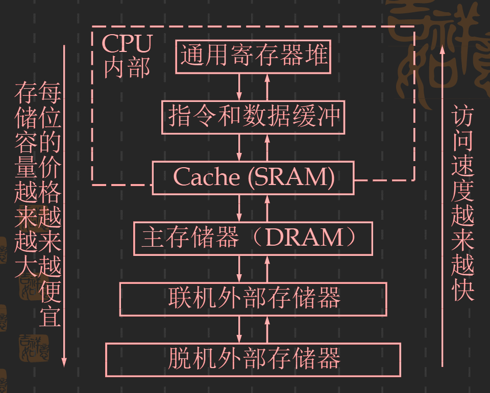
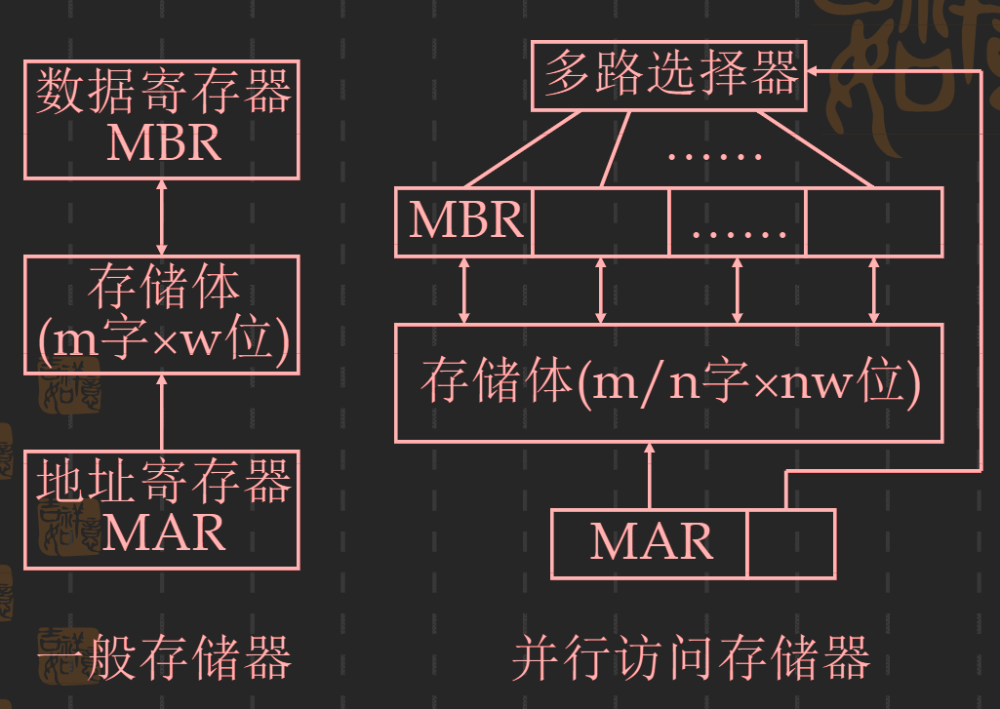
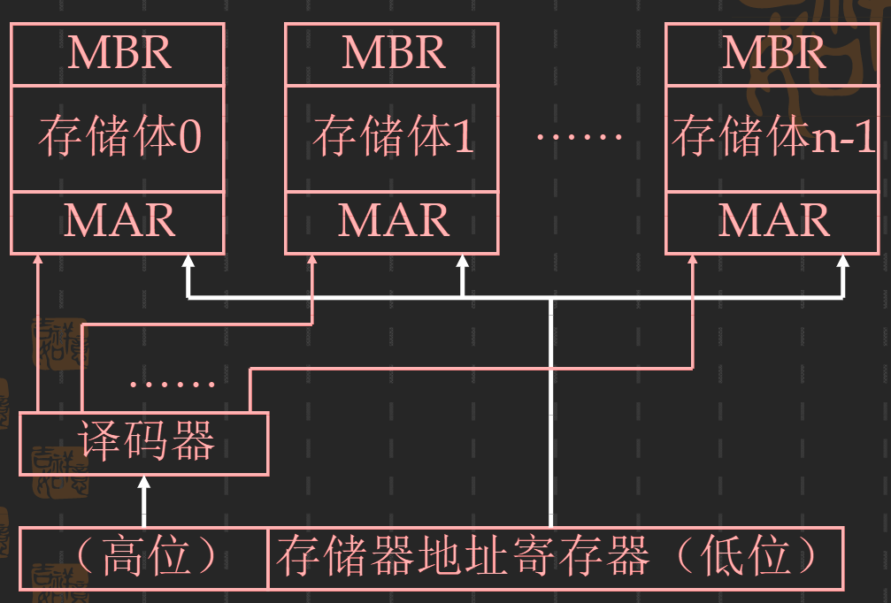
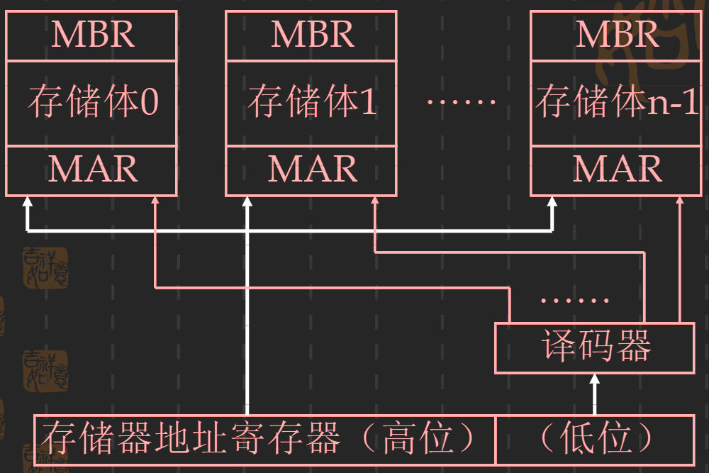

# 存储系统
*现代计算机系统都**以存储器为中心**，在计算机运行过程中，存储器是各种信息存储和交换的中心*

---
## 存储系统原理
- 存储器和存储系统的性能指标： 速度，容量，价格

### 1. 存储系统的定义
* 存储器：
    - 用途：主存储器（内存），Cache。通用寄存器，磁盘存储器等
    - 材料工艺：SRAM,DRAM，磁表面，激光等
    - 访问方式：直接译码，随机访问，相联访问，先进先出，快传送等
    
* 存储系统：
    - 定义：两个或两个以上速度、容量和价格各不相同的存储器**用硬件、软件、或软件与硬件相结合的方法**连接起来成为一个系统。该系统对应用程序员透明，从外部看就是一个存储器。
    - 存储容量 S
        - 存储系统的容量要尽可能的接近于容量最大的存储器
        - 编址方式：
            1. 选择对容量的大存储器进行编址，小存储器可以不编址（如Cache存储系统）  
            2. 在系统内部对多个存储器分别进行编址，且设计一个逻辑地址空间。将多个存储器的地址映射到该逻辑地址上（如虚拟存储系统）
    
    - 单位容量的平均价格 C
        - 公式：<!-- $ C = \frac{C_1 * S_1 + C_2 * S_2}{S_1 + S_2 }$ --> 
        - S1和S2不能相差太大
        
    - 访问周期 T
        - 命中率：$H = \frac{N_1}{N_1+N_2}，N_1，N_2$表示访问次数
        - 访问周期：$T = HT_1+(1-H)T_2$
        - 访问效率:(与命中率和构成存储系统的两级存储器速度之别有关)
        <!-- $$
        \begin{aligned}
        e & = \frac{T_1}{T}\\
        & = \frac{1}{H + (1-H)\frac{T_2}{T_1}}\\
        & = f(H,\frac{T_2}{T_1})
        \end{aligned}
        $$ --> 
        

 

    - 提高存储系统速度的两条途径
        1. 提高命中率 H
            - 预取技术：不命中时，在数据从主存储器中取出送往CPU的同时，把主存储器相邻的几个单元中的数据（称为一个数据块）都取出来送入Cache中。下次命中的概率为：<!-- $H' = \frac{H+n-1}{n}$ --> </img>，n为Cache中块大小与数据块重复使用次数的乘积，H是原来的命中率
        2. 让两个存储器的速度之比不要太大（虚拟存储器做不到）

    - 举例
        - 
        - 速度：<!-- $ T \approx min(T_1,T_2,...,T_n)$ --> 
        - 容量：<!-- $ S \approx max(S_1,S_2,...,S_n)$ --> 
        - 价格：<!-- $ C \approx min(C_1,C_2,...,C_n)$ --> 

    - 两种存储系统
        * Cache存储系统
            - 由Cache和主存储器构成，全部由硬件来调度
            - 速度接近于Cache的速度，容量是主存的容量，价格接近主存的价格
            - **目标：提高存储器的速度**
        * 虚拟存储系统
            - 由主存储器和磁盘存储器构成，需要操作系统的存储管理系统来调度
            - 速度接近于主存的速度，容量是虚拟地址空间，价格接近磁盘的价格
            - **目的：增加存储器的容量**
            
        ---
        - Cache: 一般用高速静态存储器（SRAM）实现。程序员不编址Cache，因为Cache是采用相联方式访问
        - 主存：一般用动态存储器（DRAM）实现
        ---
    

### 2. 存储器的层次结构

* 各存储器的主要性能特性

    |存储器层次|通用寄存器|缓冲栈| Cache | 主存储器 | 磁盘存储器 | 脱机存储器 |
    |:-------:|:-------:|:----:|:-----:|:-------:|:---------:|:----------:|
    |存储周期|<10ns|<10ns|10ns~60ns|60ns~300ns|10ms~30ms|2min~20min|
    |存储容量|<512B|<512B|8KB~2MB|32MB~1GB|1GB~1TB|5GB~10TB|
    |价格（$C/KB）| 1200|80|3.2|0.36|0.01|0.0001|
    | 访问方式 |直接译码|先进先出|相联访问|随机访问|快访问|文件组|
    |材料工艺|ECL|ECL|SRAM|SDRAM|磁表面|磁、光等|
    |分配管理|编译器分配|硬件调度|硬件调度|操作系统|系统/用户|系统/用户|
    |带宽(MB/S)|400~8000|400~1200|200~800|80~160|10~100|0.2~0.6|

### 3. 频带平衡
- 目的: 解决因 **CPU与主存储器的速度差距** 越来越大而导致两者不能匹配工作的问题；计算机系统中各级存储器的频带达到平衡。
- 方法：
    - 多个存储器并行工作
    - 设置多种缓冲存储器
    - 采用存储系统
    
### 4. 并行存储器 
1. 并行访问存储器
  - 示例：
  

    
    

  - 思想：把 m 字 * w 位的存储器改变成 m/n 字 * wn 位的存储器，此时一个存储周期就能访问n个数据，每个数据字长为 m 位。
  - 逻辑实现：把地址码分成两个部分，一部分作为存储器的地址，另一部分负责选择数据
  - 主要缺点：访问冲突大
    1. 取指令冲突
       - 程序转移
       - 概率小
    2. 读操作数冲突 
       - 需要的操作数不一定都在 n 数据中
       - 概率比较大
    3. 写数据冲突
       - 必须凑齐 n 个数据才能写入寄存器
       - 解决方法：设置多个数据控制器 
    4. 读写冲突
        - 一个周期内，无法对n个数据进行同时读写
        - 解决方法：设置多个数据控制器
2. 交叉访问存储器
    1. 高位交叉访问存储器
        - **主要目的：扩大存储器的容量**
        - 实现方式：用地址码的高位来区分存储体号
        - 要求：**每个存储模块都有各自的独立的控制部分**，即每个模块都可独立工作
        - 实例图：

        

        
        

        - 参数计算方法
          - m ：每个存储体的容量
          - n ： 存储体的个数
          - j ：存储体的体内地址 <!-- $j \in \{0,m-1\}$ --> 
          - k : 存储体的体号 <!-- $k \in \{0,n-1\}$ --> 
          - 存储器地址：<!-- $A = k \times m + j$ --> 
          - 存储器的体内地址：<!-- $A_j = A \ mod \ m$ --> 
          - 存储器的体号：<!-- $A_k = \lfloor \frac{A}{m}\rfloor$ --> 
      
    2. 低位交叉访问存储器
        - **主要目的：提高存储速度**和提高存储容量 
        - 实现方式：用地址码的低位区分存储体号
        - 实例图：

        

        
        

        - 参数计算:
          - A的存储地址：<!-- $A = j \times n + k$ --> 
          - 存储器的体内地址: <!-- $A_j = \lfloor \frac{A}{n}\rfloor$ --> 
          - 存储器的体号：<!-- $A_k = A\ mod\ n$ --> 

        - 加速原理：
          - 低位交叉访问存储器实际是采用了一种**流水线**的方式工作的**并行存储器系统**；在**连续工作**的情况下，保持每个存储体的速度不变，而整个存储器的速度**可以提高n倍**
            > 减少的部分为存储周期中的恢复时间\
            > 存取周期 = 存取时间 + 恢复时间
          - 存储体的启动时间间隔：<!-- $t = \lfloor \frac{T_m}{n} \rfloor$ --> 
            > Tm：为**存储器**(**不是存储体**)的存取周期
    
    ---
    >- 低位交叉访问存储器的速度不能提高n倍的根本原因是：访问冲突
    >- **访问冲突的根源：转移指令和数据的随机性**
    >- 访问冲突计算：
         >>- 每个存储周期能访问到的平均有效字的个数，也称并行存储器的加速倍速：

         >>- 转移概率：从存储器中读出的指令是转移指令而且转移成功的概率（g）
         >>- <!-- $N = \frac{1 - (1-g)^n}{g}$ --> 
    --- 
- 一种无访问冲突存储器  (课本 144~146)
  - 一维数组访问：将存储体的个数选为质数(与变址位移量互质)
  - n x n二维数组访问：
    - 方案一：
      - 要求：存储个数 m 要大于n的，必须为质数；
 
        公式：m = 22p+1 <=> p为任意自然数
      - 方法：同列相邻的元素错开 2p 个存储体，同行相邻的元素错开 1 个存储体存放
      - 体号地址 = （2p i+j+k）MOD m； k 为第一个元素所在体号
      - 体内地址 = i
      - 缺点：有1/(n+1)个存储单元浪费
      - 优点：在读或写并行存储器使所需要的对准网络简单
    - 方案二：
      - 要求：n = 22p <==>p为任意自然数
      - 缺点：在读或写并行存储器使需要借助非常复杂的对准网络
      - 优点：没有浪费存储单元

