## 虚拟存储器
> _又称虚拟存储系统，虚拟存储体系。主要由**主存储器和外部存储器**共同组成_ 

> _主存储器通常用DRAM：容量小，速度快_ 

> _外部存储器通常由磁盘存储器：容量大，速度慢_

### 1. 虚拟存储器工作原理
_这里页式存储器为例_
* 概念：
  * 页\
    把主存储器、磁盘存储器和虚拟存储器都划分成固定大小的块(在页式存储器中称作页)
    > 主存储器的页称为实页，虚拟存储器称为虚页
  * 地址：\
    主存地址A = 实页号p + 页内偏移d \
    虚拟地址Av= 用户号U + 虚页号P + 页内偏移D
* 流程
    1. 用户程序先给出多用户虚拟地址Av
    2. 由操作系统和硬件共同对 Av 进行内部地址变换
    3. 若变换成功，则得到主存地址A；之后用A访问主存储器，获取数据
    4. 若变换失败，则表示数据不在主存储器中，必须访问磁盘存储器
    5. 由软件对 Av 进行外部地址变换，获取磁盘存储器地址
    6. 查主存实页表，看主存储器中是否有空页
    7. 若主存储器存在空页，把磁盘储存器中所要访问数据的所在页调入到主存储器的空页上
    8. 若主存储器中没有空页，则采用页面替换算法。将主存储器中暂时不用的一页写回磁盘存储器中，之后再执行上一步
    

    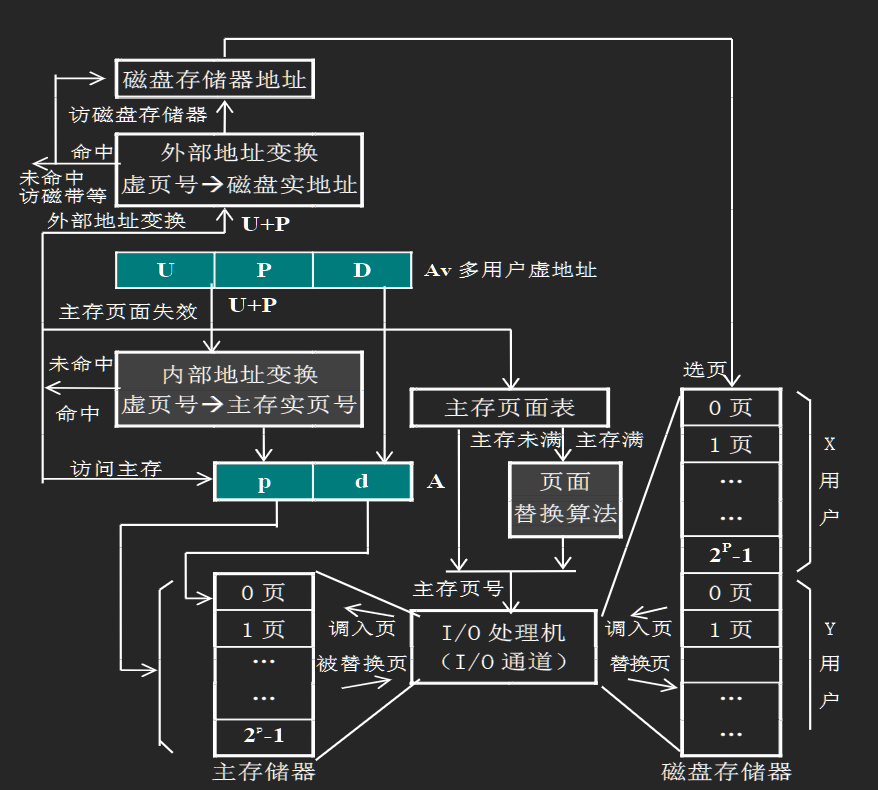
    
 

### 2. 地址的映像与变换
- 虚拟存储器中的地址空间
  - 虚拟地址空间 ----------->虚拟地址-------->应用程序员编写程序的地址空间
  - 主存储器地址空间 ------>主存储器地址
  - 辅存地址空间 ----------->磁盘地址

- 地址映像：把虚拟地址空间映象到主存地址空间
  > 用虚拟地址编写的程序按照某种规则装入主存储器的同时，建立虚拟地址与主存实地址的对应关系
- 地址变换\
  在程序运行时，把多用户虚拟地址变换成主存储器地址（内部变换）或磁盘存储器地址（外部变换）  
> *根据采用的地址映像和地址变换的不同，可以分成三种虚拟存储器：页式虚拟存储器，段式虚拟存储器，段页式虚拟存储器*

- 段式虚拟存储器

  ---
    > 段表：一个段表控制一个程序
        >> - 位置：通常放置在主存储器中；若段表太长，则把暂时不用的放置到磁盘中
        >> - 内容：段号 + 程序段长度 + 在主存中的起始地址 + 其他信息

    > 段表基址寄存器堆
        >> - 位置：位于CPU中
        >> - 段表基址寄存器：每个程序对应一个段表基址寄存器
        >> - 内容：段表基址寄存器 = 段表的长度 + 段表的起始地址 

  ---
  - 目的：满足程序员将程序分段，并通过名称或序号访问特定程序段的要求
  - 地址映像方法：将每一道程序由一个段表控制，每个程序段在段表中占一行，程序段的长度是可以任意长(区别于页虚拟存储器)
    > 示例图：
    > 

    > 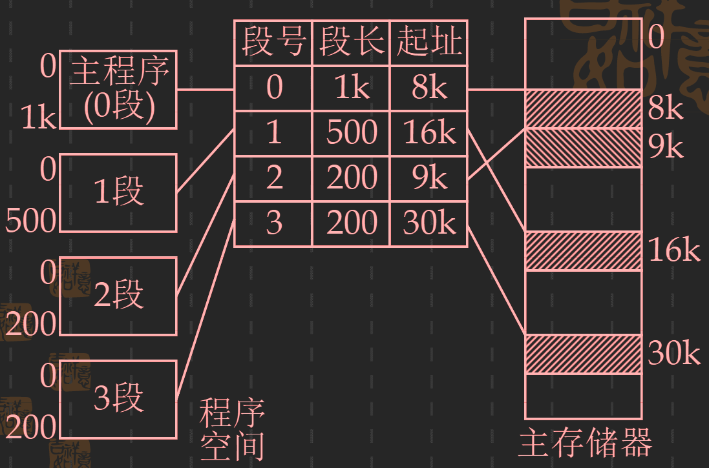
    > 

  - 地址变换
    - 流程：
      - 通过虚拟地址的用户号U在段表基址寄存器堆中找到相应的基址寄存器
      - 从该寄存器中读出段表的起始地址
      - 段表起始地址 + 虚拟地址中的段号 = 程序段的段表地址
      - 访问程序段的段表地址，获取程序段的全部信息（包括程序段的起始地址）
      - 程序段的起始地址 + 虚拟地址中的偏移地址 = 主存储器实地址
    - 示例图：
    

    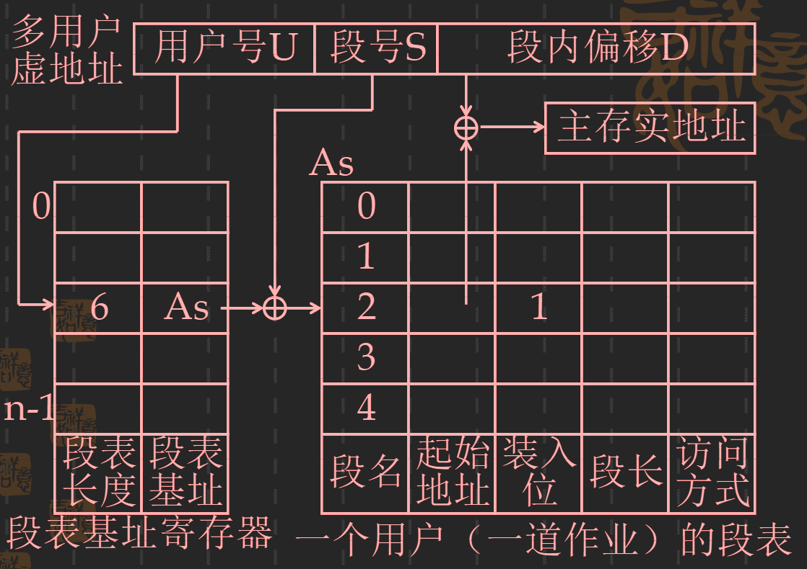
    
 
    
    > 段长和访问方式是来保护程序段\
    > 装入位表示：起始地址是在磁盘中还是在主存储器中
  - 主要优点：
    - 程序的模块化性能好
    - 便于程序和数据的共享
    - 程序的动态链接和调度比较容易
    - 便于实现信息保护
  - 主要缺点：
    - 地址变换所花费的时间比较长
    - 主存储器的利用率往往比较低
    - 对辅存的管理比较困难
  
- 页式虚拟存储器
  - 页：把虚拟地址空间和主存储器的地址空间划分成一个个固定大小的块，每块称为页。是一种逻辑上的划分，由系统管理软件任意指定。
  - 地址映像：
    

    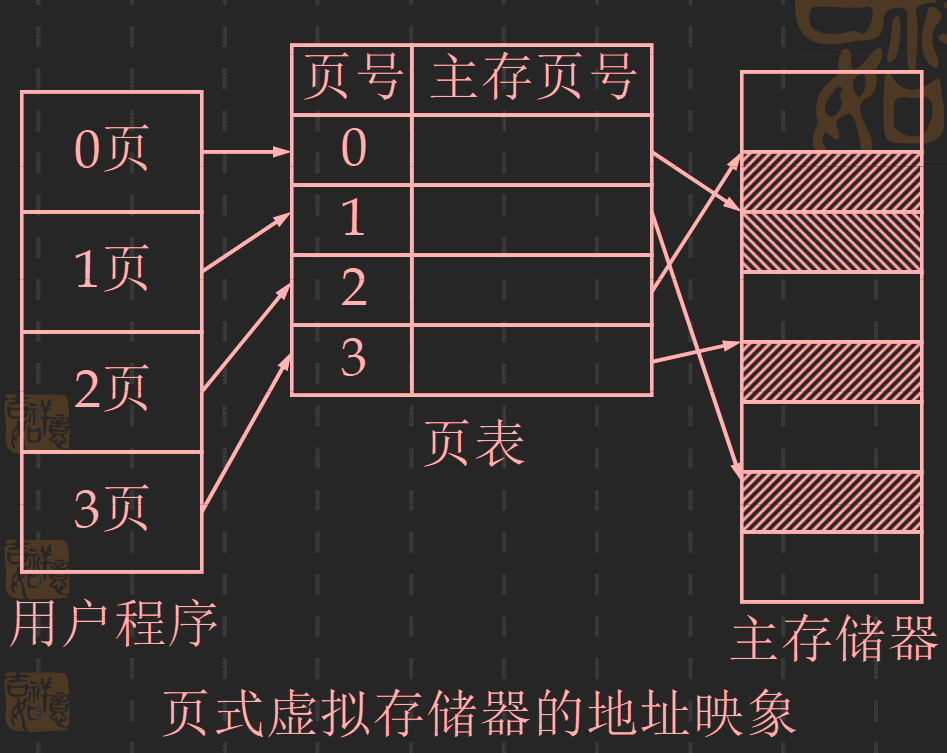 
    

  - 地址变换：
    

    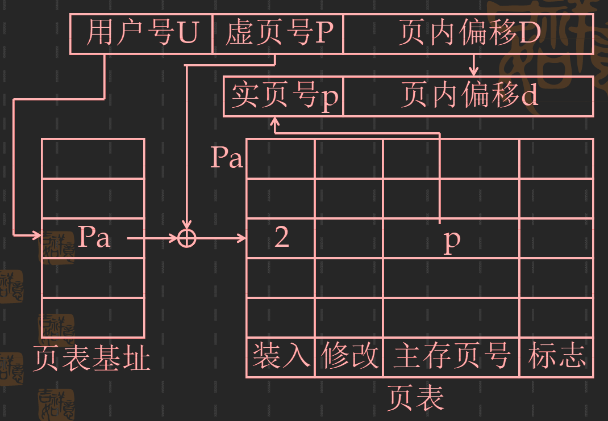
    

  - 主要优点：
    - 主存储器的利用率比较高
    - 页表相对比较容易实现
    - 地址映像和变换的速度比较快
    - 对辅存的管理比较简单
  - 主要缺点：
    - 程序的模块化性能不好
    - 页表很长，需要占用很大的存储空间
  
- 段页式虚拟存储器
  - 目的：为了同时获得段式虚拟存储器在程序模块化方面的优点和页式虚拟存储器在管理主存和辅存物理空间方面的优点
  - 基本思想：对用户编写程序的虚拟空间采用分段的方法管理，而对主存储器的物理空间采用分页的方法管理
  - 地址映像:
    

    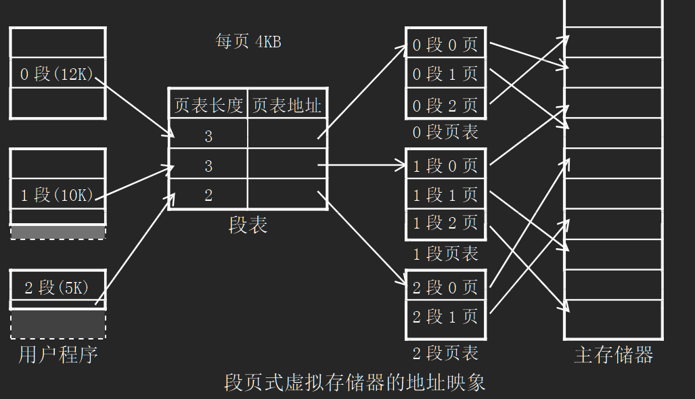
    

  - 地址变换
    

    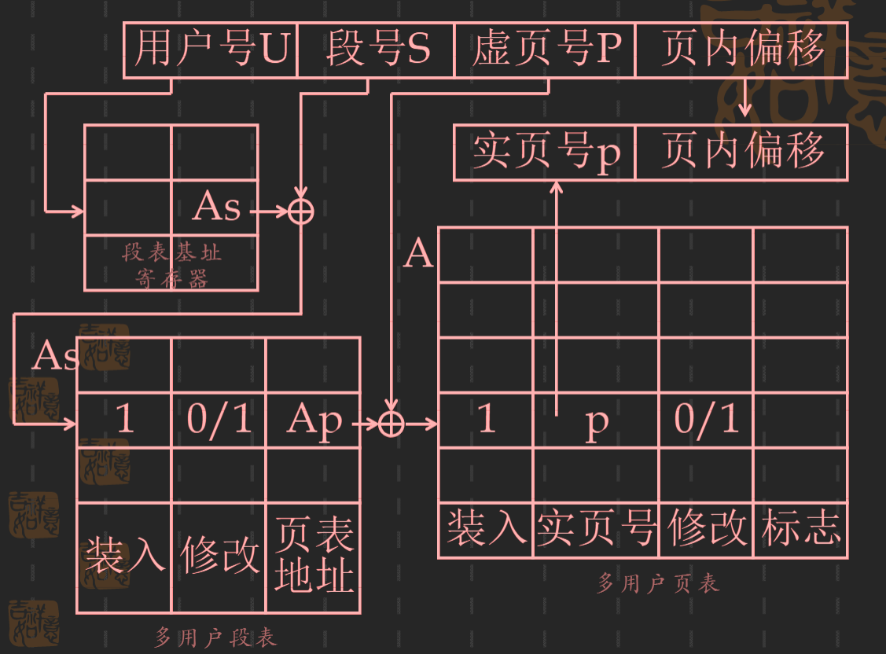
    

  - 缺点：
    - 速度慢

- 外部地址变换\
_当页表或段表中的有效位指示发生页面失效时，表示需要访问的那一页或那一个程序段还没装入到主存储器中，其实就需要进行外部地址变换_

  - 目的：找到辅存（磁盘存储器）的实地址，并把需要访问的那一页或那一段调入到主存储器中
  - 实现：通常用软件实现
  - 流程
  

  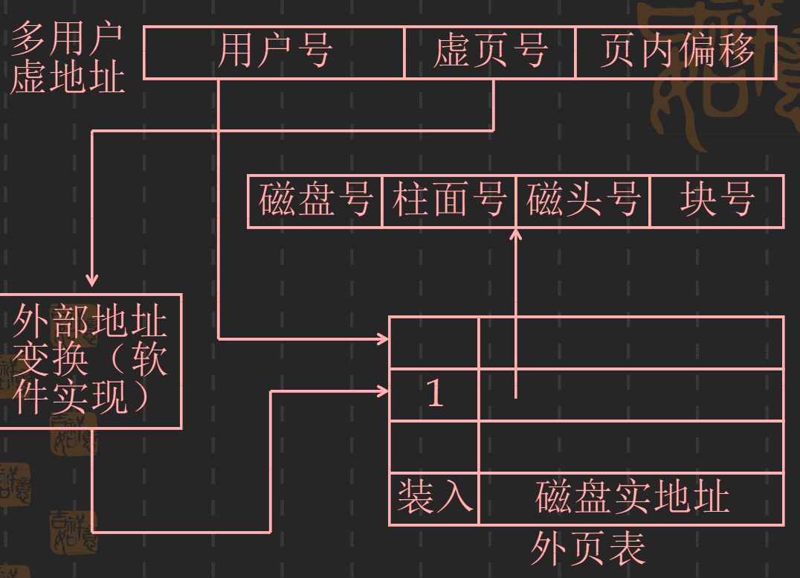
  

  - 外页表：每个程序对应一张外页表，外页表中的装入位表示访问的页面是否存在于磁盘存储器中。当整个程序的装入和执行过程中，不需要磁盘、光盘等海量存储介入时，外页表可以和内页表合并

  > 在操作系统中，页面失效是一种异常故障，需要立即响应并处理。

  > 在处理页面失效前，需要先保存现场。以便后面的程序继续进行\
  > 方法：采用硬件缓冲寄存器；只保存部分现；采用指令预判技术等

### 3. 加快内部地址变换的方法
> 造成虚拟存储器速度降低的两个主要原因：
>   - 在段式或页式虚拟存储器中，要访问主存储器必须先查段表或页表，在段页式中，两个都要查。若段表和页表都在主存储器中，则主存储器的访问速度要降低2到3倍
>   - 采用多级页表（包括段表）使得访问主存储器的次数增加
>---
> 采用多级页表的原因：解决页表和段表在映像到主存储器的不连续的页面位置上

- 目录表
  - 基本思想：压缩页表的存储容量，用一个容量比较小的高速存储器来存放页表，从而加快页表的查表速度
  - 方法：页表只为已装入到主存储器中的那些页面建立虚页号与实页号之间的对应关系，并采用相联方式访问
  - 特点：采用高速度小容量存储器实现，查表速度快；但可扩展性差，当主存储器容量到达一定数量后，目录表的造价高，查表速度降低
  - 地址变换过程：
  

  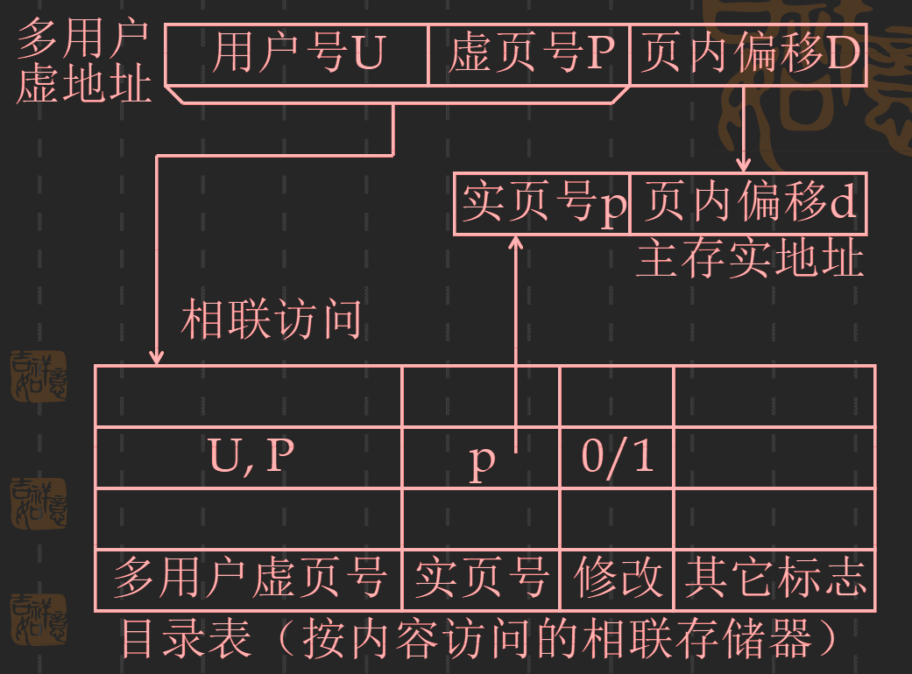
  

- 快慢表
  - 快表与慢表构成了一个由两级存储器组成的存储系统
    - 快表：小容量页表；采用相联方式访问。只是慢表的一个部分副本；独立于主存储器外；由硬件实现
    - 慢表：存放在主存储器中的页表，全表；由软件实现
  - 地址变换
    

    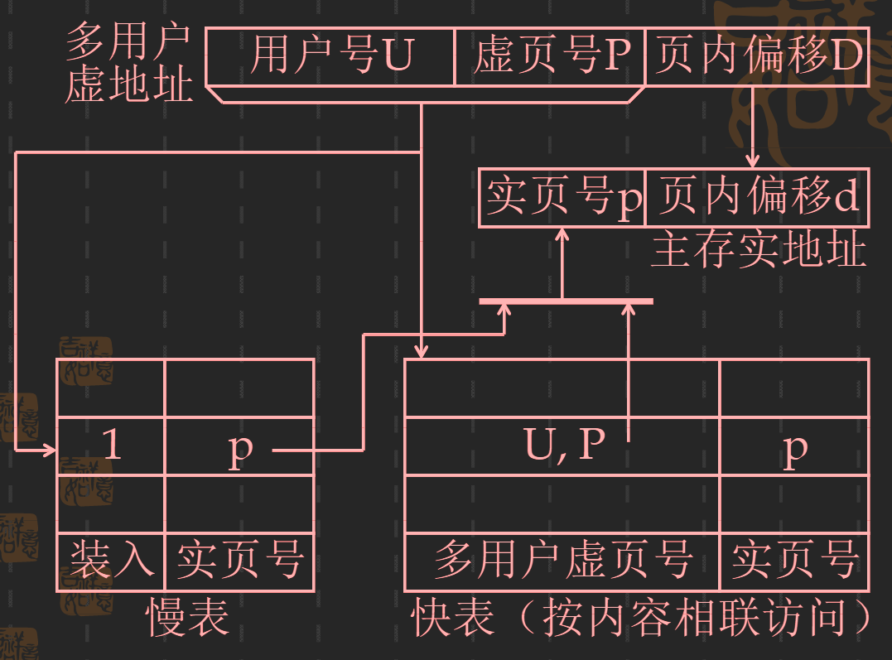
    

    ---
      - 快表和慢表是同时访问的。快表的访问速度远远大于慢表
      - 当快表访问到时，停止访问慢表
      - 当慢表访问到时，把实页号P送往主存储器的地址寄存器，并把该行信息送入到快表中，若快表已满，则采用替换算法
    ---
  - 优点：只要快表的命中率很高，虚拟存储器的访问速度就能与主存储器的工作速度很接近
- 散列函数
  - 目的：把快表的相联访问方式变成按地址访问方式，从而在加大快表的容量不减小快表的查询速度
  - 由于快表中的散列函数必须用硬件来实现，所以通常采用简单的函数关系
  - 地址变换
  

  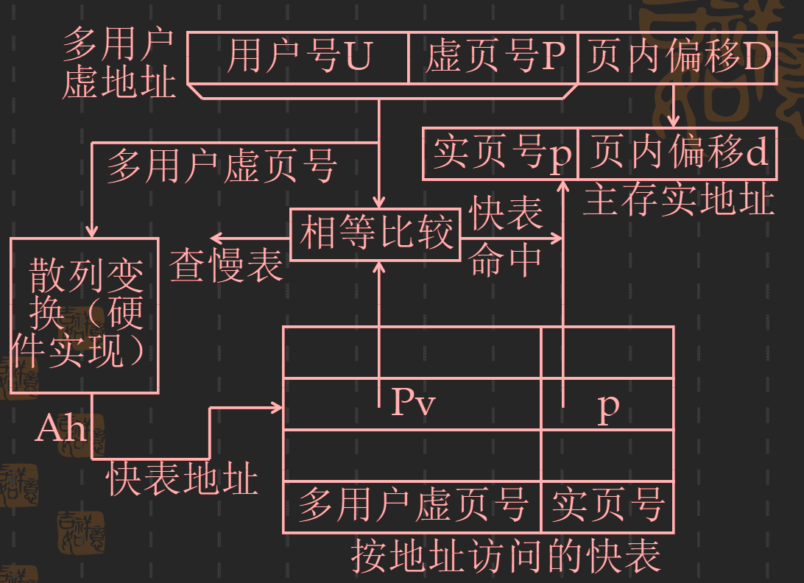
  

  *地址变换：避免因散列冲突而发生查快表时的错误*\
  *查快表和慢表都是同时进行的*\
  *以相联访问方式的存储器，在加大容量后，访问速度会减小*

- 虚拟存储器举例：
  - IMB370/168计算机 （P162 图）
  - Intel i486处理机 （P163 图）

### 4. 页面替换算法及其实现
> 评价页面替换算法的标准：
> 1. 命中率 => 能否正确反映程序的局部性，充分利用页面调度的历史信息
> 2. 实现难度
>
> 页面替换算法的使用场合
> 1. 虚拟存储器中，主存页面（或程序段）的替换 => 软件实现
> 2. Cache中的块替换 => 硬件实现
> 3. 虚拟存储器中，快表存储字（行）的替换     => 硬件实现
> 4. 虚拟存储器中，用户基地址寄存器的替换     => 硬件实现
> 5. 虚拟存储器中，目录表的替换

* 页面替换算法
  * 随意算法 (RAND算法)
    * 利用软件或硬件的随机数发生器来确定主存储器中被替换的页面
    * 算法简单、容易实现
    * 没有利用历史信息，没有反映程序的局部性，命中率低
  
  * 先进先出算法 (FIFO算法) 
    * 思想：最先调入主存储器的页面作为被替换页面
    * 优点：容易实现，能利用页面调度情况的历史信息
    * 缺点：没有反映程序的局部性（最先调入的主页面，很可能是经常使用的页面）
  
  * 近期最少使用算法(LRU算法)
    * 思想：选择**近期最少访问**的页面作为被替换的页面
    * 优点：反映了程序的局部性，充分利用了历史调度信息
    * 缺点：实现困难（每个页面都需要设置一个很长的计数器）

  * 最久没有使用算法(LFU算法)
    * 思想：把**近期最久没有被访问过**的页面作为被替换的页面
    * 优点：实现简单，把LRU算法记录数量上的“多”“少”简化成了“有”“无”

  * 最优替换算法(OPT算法)
    * 思想：选择将来最久不被访问的页面作为替换页面
    * 理想化的算法
    * 用途：作为评价其他页面替换算法好坏的标准
  
  *常用的算法是：LFU，FIFO*

* 堆栈型替换算法\
*指一类算法；研究分配给程序的主存页面数的增加与命中率的关系*
  * 基本思想：随着分配给程序的主存页面数增加，主存的命中率也提高，至少不至于下降
  * 定义：对任意一个程序的页地址流作两次主存页面数分配，分别分配m个主存页面和n个主存页面，并且<!-- $m \leq n$ --> 。如果在任何时刻t，主存页面数集合<!-- $Bt$ --> 都满足关系：<!-- $Bt(m) \subseteq  Bt(n)$ --> ，则该类算法称为堆栈型算法

  *FIFO 不是堆栈型算法；LRU,LFU, OPT属于堆栈型算法*
  > 对于堆栈型算法的多道系统程序中，有一种动态页面调度的方法：页面失效频率法（PFF）
  > - 具体做法：系统动态调整分配给每道程序的主存页面数：当一道程序的命中率低于某个限定值时，增加分配给该到程序的主存页面数；当命中率高于某个限定值时减少分配给该程序的主存页面数。使整个系统的总命中率和主存利用率得到提高

* 页面替换算法的实现
  * 页面表 （不是页表）
    * 作用：记录主存储器中每个页面的当前使用状况
    * 面向主存储器，每个主存储器只有一张主存页面表
    * 结构：
      * 实页号：可以忽略
      * 占用位：表示页面是否被占用
      * 程序号和段页号：表示该页面是被哪个程序的哪个段、哪个页占用
      * FIFO算法中：使用位为一个计数器
      * LFU算法中：使用位为一个bit位

    |||||||||
    |:---:|:----:|:----:|:---:|:---:|:---------:|:------:|:-----:|
    |实页号|占用位|程序号|段页号|使用位|程序优先级|历史位Hb|其他信息| 
    
### 5. 提高主存命中率的方法
> 影响主存命中率的主要因素：
> 1. 程序在执行过程中的页地址流分布情况
> 2. 所采用的页面替换算法
> 3. 页面大小
> 4. 主存储器的容量
> 5. 所采用的页面调度方法
 
* 页面大小的选择
  * 容量一定时，当页面比较小时，命中率随页面的增大而逐渐提高，当页面比较大时，命中率随页面的增大而降低。
  * 关系图：
  

  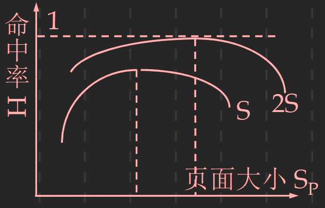
  

  
  * 页面大小的选择一般通过对典型程序的模拟实验来确定
  > * 页面太大：程序的最后一个页面容易装不满，造成浪费
  > * 页面太小：降低主存储器的利用率（页表或页面表的比例增加）

* 主存容量
  * 主存命中率随着分配给程序的主存容量的增加而单调上升
  * 关系图：
  

  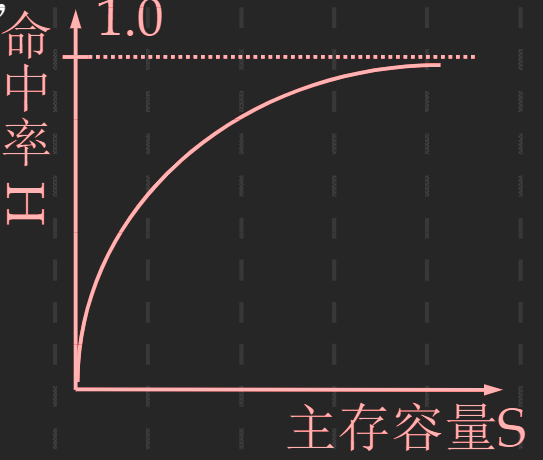
  

  
* 页面调度方式
  * 分页式
    * 在程序装入主存储器之前就对程序进行链接装配，并且要在整个程序调入到主存储器后才开始运行
    * 主存命中率：100%，但主存利用率低，而且当主存空间小于从程序所需主存空间时，程序无法装入到主存储器中运行
  
  * 请求页面式（大多数机器采用）
    * 在发生页面失效时，才把要访问的页面进行链接装配，并调入主存储器中
    * 主存利用率高，但处理页面失效的时间长
  
  * 预取式 （折中方案）
    * 在程序被挂起后又重新开始运行之前，先把上次停止运行前一段时间内用到的页面先调入到主存储器中，然后才开始执行程序
    * 优点：避免程序刚开始运行时，频繁发生页面失效的情况
    * 缺点：如果调入的页面用不上，则浪费调入的时间，占主存资源

