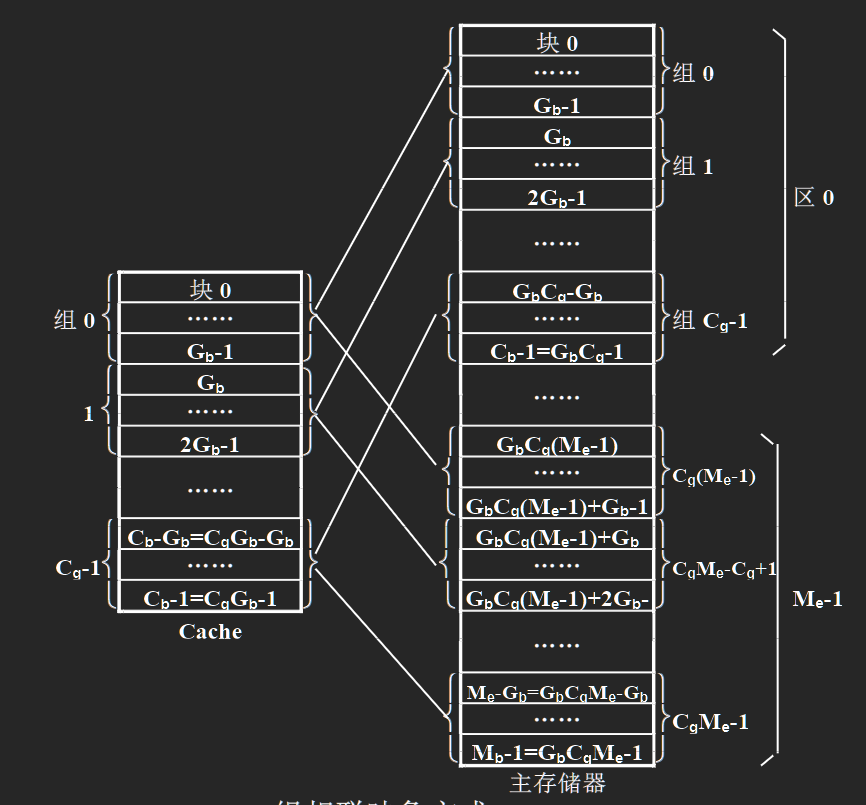
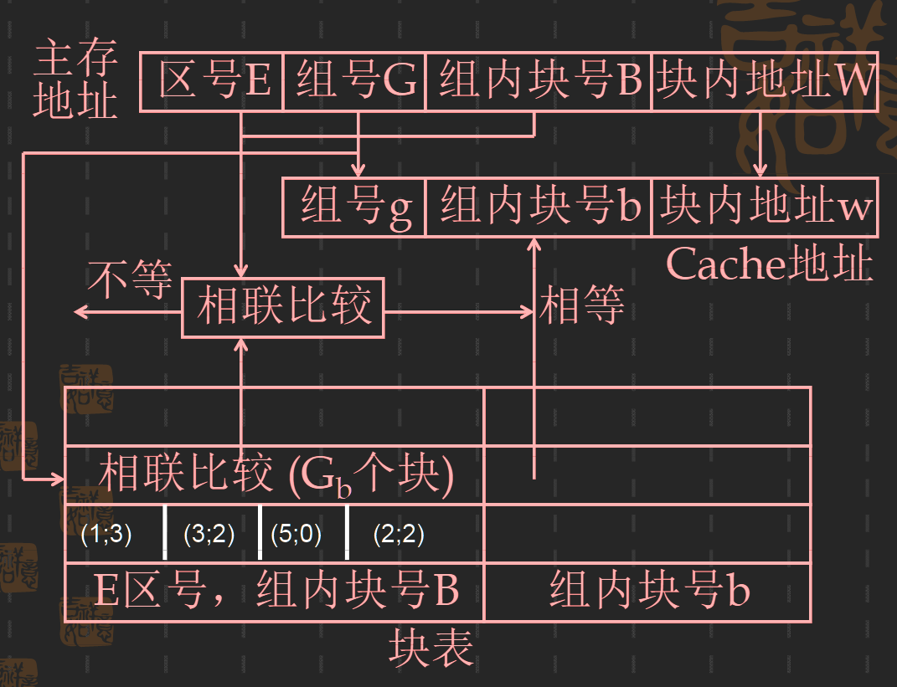

## 高速缓冲存储器(Cache)
|存储系统|Cache|虚拟存储器|
|:-----:|:----:|:-------:|
|要达到的目标|提高（主存）速度|扩大（主存）容量|
|实现方法|全部硬件|软件为主，硬件为辅|
|两级存储器速度比|3倍~10倍|105倍|
|页（块）大小|1字~16字|1KB~2KB|
|等效存储量|主存储器|虚拟存储器|
|透明性|对系统和应用程序员|仅对应用程序员|
|不命中时处理方式|等待主存储器|任务切换|
### 1. 基本的工作原理
<image src = './图片/cache基本工作原理.png' width = 60% style = "border-radius:2%;margin-left:20px">

### 2. 地址映像与变换方法
- 地址映像：把主存地址空间映像到Cache地址空间
  > 把存放在主存中的程序按照某种规则装入到Cache中，并建立主存地址与Cache地址之间的对应关系
- 地址变换：当程序已经装入到Cache中，在实际运行过程中，把主存地址如何变换成Cache地址
- 选取地址映像方法考虑的主要因素：
  - 地址变换的硬件要容易实现
  - 地址变换的速度要快
  - 主存空间利用率要高
  - 发生块冲突的概率要小
> _地址映像和地址变换都是以块为单位进行调度的_
1. 全相联映像及其变换
    - 映像方式
    
    <image src = './图片/全相联映像方式.png' width = 60% style = "border-radius:2%;margin-left:30px"> 

    - 地址变换
      - 主存块号、Cache块号和有效位
      - 有效位：标记目录表中的各个存储字是否有效
        <image src = './图片/全相联地址变换.png' width = 70% style = "border-radius:2%;">

    - 优点：块的冲突率最小，Cache的利用率最高
    - 缺点：需要相联访问速度很快，容量为Cb的相联存储器，代价高；相联比较所花费的时间将影响Cache的访问速度
    > 在虚拟存储器中一般采用全相联映像的方式

2. 直接映像及其变换
   - 映像方式:
     - 主存中一块只能映射到Cache的特定块中。
     - <!-- $b = B \ mod \ C_b$ --> ，其中B为主存的块号，b为Cache的块号，Cb为Cache的块容量
    <image src = "./图片/直接映像方式.png" width = 60% style = "border-radius:5%;margin-left:60px">

    > 整个Cache地址与主存地址的低位部分是完全相同的。
    - 地址变换
      - 区号存储器：存放主存区号的小容量存储器。通过主存地址中的块号访问区号存储器。\
      <image src = "./图片/直接映像的地址变换.png" width = 80% style = "border-radius:2%;" >
    > 通常为了提高Cache的访问速度，可以把区号存储器与Cache合并到同一个存储器上\
    > <image src = "./图片/快速直接映像的地址变换.png" width = 80% style = "border-radius:2%;margin-left:40px">
    
    - 优点：硬件实现简单，访问速度快；不需要地址变换，主存地址的低位部分就是Cache的地址
    - 缺点：冲突率比较高 

3. 组相联映像及其变换
> 介于全相联和直接相联之间的一种折中方案
  - 映像方式
    1. 把主存和Cache按同样大小划分成块，按同样大小划分成组，每一组都由相同的块数组成
    2. 从主存的组到Cache的组之间采用直接映像方式
    3. 在两个（主存和Cache）对应的组内采用全相联映像
    
  - 地址变换
    1. 用主存地址中的组号访问块表存储器
    2. 从块表存储器中读出一组字
      > _字的个数为组内块的容量，块表存储器的容量与Cache的块数相等_
    3. 把这组字的区号和组号与主存地址中相应的区号和块号进行相联比较 
      
    > 1. 为了提高Cache的访问速度，可以把Cache的地址变换与访问Cache并行进行
    > 2. 可以采用把块表存储器中一个相联比较的组按块方向展开存放，设置多个比较器来代替相联访问，以加快查表速度
    > 3. 当一个块字数不多时，可把Cache和块表合并成一个存储器

    > 181页的图3.46
  
  - 特点
    - 与直接映像方式相比：冲突概率小，Cache的利用率高；但实现难度和造价高
    - 与全相联映像方式相比：容易实现；
    - 可以通过调节每组的块容量和Cache的组容量来优化Cache的性能
    > 每组块容量越多，块的冲突概率和Cache的失效率就越低，但查表速度就越慢，实现成本越高
  
  - 变体
     1. 位选择组相联映像及其变换
        - 映像方式：Cache分组，主存按照Cache的组容量分区
          - 主存中的块与Cache中的组之间是直接映像的关系
          - 主存中的块与Cache组内部的各个块是全相联映像方式
        - 特点：
          - 主存中的一个块到Cache中的一个组之间===> 一个块到多个块
          - 映像关系简单，实现容易，数据分布不连续
        - 图片 课本 P183
     2. 段相联映像及其变换
        - 映像方式
          1. 把主存和Cache按同样大小划分成块，按同样大小划分成段，每一段都由相同的块数组成
          2. 从主存的组到Cache的组之间采用全相联映像
          3. 在两个（主存和Cache）对应的组内采用直接映像
        - 特点：主存不需要分区；段表简单，实现成本低；当发生段失效的时候，本段内各个块的映像关系全部作废
        - 课本 P184 图3.49 和 P185 图3.50

### 3. Cache替换算法及其实现
  > 直接映像及变换方式实际上不需要替换算法，原因主存中的块映像到Cache中唯一的块\
  > 全相联映像及变换的替换算法最复杂
- Cache替换算法使用的时间：
  - 发生块失效，且可以装入新调入块的几个Cache块都已经被装满时
- Cache替换算法要解决的问题：
  1. 记录每次访问Cache的块号 ====> 寄存器/计数器
  2. 管理好所记录的Cache块号 ====> 排序、计数、清除、置位
  3. 根据记录和管理的结果，采用时序逻辑判断哪个块号将要被替换出去
1. 随机法：
   - 优点：实现容易
   - 缺点：没有利用程序的局部性和历史上的块地址流分布情况

2. 轮换法及其实现
   - 常用于组相联映像及地址变换方式中
   - 两种实现方式
     1. 每块一个计数器
        - 在块表的每个存储字中添加一个替换计数器字段，长度与Cache地址中组内块号字段的长度相同
        - 替换方法及计数器的管理规则
          - 被装入或被替换块，他所属的计数器清零，同组的其他块计数器加1    
          - 需要替换时，在同组中选择计数器的值最大的块作为被替换的块
     2. 每组一个计数器
        - 只为每个组设置一个计算器
        - 替换方法：当本组有替换时，计数器加1，计数器的值就是要被替换出去的块号
   - 优点：实现简单；能利用历史上的块地址流情况
   - 缺点：没有利用程序的局部性特点
  
3. LFU算法及其实现
   - 常用于虚拟存储器中
   - 计数器设置：为块表中每一块设置一个计数器，长度和Cache地址中组内块号字段的长度相同
   - 计数器的使用及管理规则
     - 被装入或被替换的块，对应的计数器清零，同组其他所有块的计数器都加1
     - 命中的块，对应得计数器清零。同组中凡是计数器值小于命中块的计数器原来值的块的计数器都加1
     - 需要替换时，替换掉同组计数器中值最大的块
   - 优点：既能利用历史上Cache中块地址流的调度情况，也可以正确反映程序的局部特性
   - 缺点：控制逻辑复杂
  
4. 比较对法
    - 实际是LFU算法，但用硬联逻辑实现
    - 用一个两态的器件（触发器）记录两个块之间的先后顺序，多个块之间的先后顺序可以用多个两态器件的组合来实现，从而可以在多个块中找出最久没有被访问过的那个块来
    - 每次访问之后要改变触发器的状态。
    - 优点：块的失效率比较低，工作速度高（不分级的话）
    - 缺点：硬件实现相对复杂，需要比较多的触发器 

5. 堆栈法
  - 用栈顶至栈底的先后次序来记录Cache同一组内的各个块被访问的先后次序
  - 栈顶是最近被访问过的块，栈底是最久没有被访问过的块
  - 管理规则：
    - 把本次访问的块号与堆栈中保存所有的块号进行相联比较
    - 若有相等，则命中。去除堆栈中本次访问的块号，将栈顶到本次访问的块号之间的块号全部下移，在本次访问的块号从栈顶压入。
    - 若没有相等，则Cache块失效。把栈底块号移除，堆栈内全部块号下移，把访问的块号压入
  - 优点：块失效率比较低，硬件实现简单
  - 缺点：速度慢
### 4. Cache的性能分析