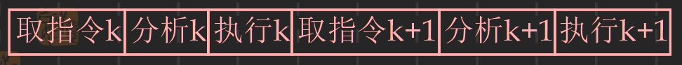
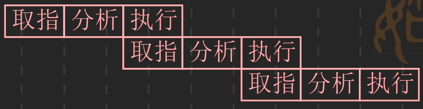
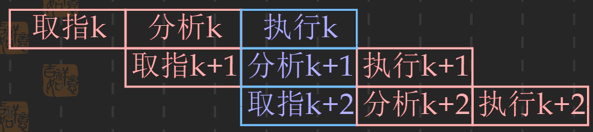
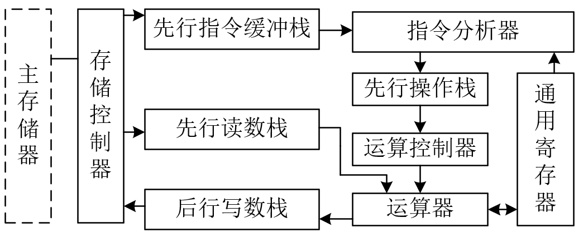
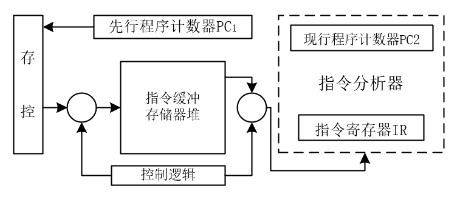

# 标量处理机
- 只有标量数据表示和标量指令系统的处理机称为处理机
- 设计处理机的基本任务之一：缩短解释指令的时间
- 提高指令执行速度的途径
  - 提高处理机的主频
  - 采用更好的算法和设计更好的功能部件
  - 多条指令并行执行，称为指令级并行技术
    - 采用流水线技术
    - 多操作部件处理机/超标量处理机
    - 超长指令字(还在研究中)

# 先行控制技术
- 先行控制技术的关键：缓冲技术和预处理技术
- 尽量使指令分析器和指令执行部件独立地工作，并始终保持忙碌状态

## 指令的重叠技术
- 一条指令的执行过程：
  - 取指令：按照指令计数器的内容访问主存储器，取出一条指令送到指令寄存器
  - 指令分析：对指令的操作码进行译码，按照给定的寻址方式和地址字段中的内容形成操作数的地址，并用这个地址读取操作数
  - 指令执行：根据地址码的要求，完成指令规定的功能，并把运算结果写回到寄存器或主存储器中

- 指令的执行方式：
  - 顺序执行 ======> <!-- $T =\sum_{i=1}^{n}{t_{取\ 指\ 令\ i} + t_{分\ 析\ i} + t_{执\ 行\ i}}$ --> 

    
  - 一次重叠执行 ===><!-- $T=(1+2n)t$ --> 

    

  - 二次重叠执行 ===><!-- $T=(2+n)t$ --> 

    

- 重叠技术的优点：
  - 指令的执行时间缩短
  - 功能部件的利用率提高
- 重叠技术的缺点：
  - 需要增加硬件
  - 控制过程复杂
  
## 先行控制方式的原理和结构
- 采用二次重叠执行方式需要解决的问题
  - 需要独立的取指令部件，指令分析部件和指令执行部件
    > 把顺序执行方式中的一个集中的指令控制器，分解成三个相对独立的控制器
    > 分别为存储控制器、指令控制器、运算控制器
  - 需要解决访问主存储器的冲突问题
    - 把主存储器分成两个独立编址的存储器，一个专门存放指令，另一个专门存放操作数。并规定执行阶段的产生的运算结果只写到通用寄存器，不写到主存
      > 缺点：存储器对于汇编语言程序员和机器语言程序员是不透明的\
      > 哈佛结构：两个一级Cache，指令Cache和数据Cache
      
    - 指令和数据混合存放在同一主存中，使用低位交叉存取方式，在一个存储器周期内访问多个存储单元
      > 不能从根本上解决访问存储器冲突问题
    - 解决访问存储器冲突的根本办法是采用先行控制技术

- 先行控制的关键：
  - 缓冲技术：在工作速度不固定的两个功能部件之间设置缓冲栈，用于平滑他们的工作
  - 预处理技术

- 先行控制与一次重叠执行方式的本质差异：先行控制器在指令分析器和指令执行部件中间同时处理的是两条可能不相邻的指令

### 处理机结构

- 指令缓冲栈、先行读数栈、先行操作栈、后行写数栈保证了存储控制器，指令分析器和运算控制器能够各自独立的工作。这四个缓冲栈统称为先行控制器
- 
- 指令缓冲栈：数据寄存器堆 + 控制逻辑
  - 工作方式：先进先出
  - 一般处理机中将，先行指令缓冲栈的取指令安排在最低优先级
    

### 指令执行时序
- 设置缓冲栈的目的：减少两个功能部件因工作时间不相等而带来的速度损失。让这两个功能部件各自完全独立工作，以充分发挥每个功能部件的作用
### 先行缓冲栈
- 先行指令缓冲栈：平滑主存储器和指令分析器的工作
- 先行操作栈：
  - 对于运算型指令，移位指令，数据传送指令，指令分析器会将指令分析成RR型指令（寄存器-寄存器型），后送入先行操作栈
  - 对于RX型（变址型）指令和RS型（存储器型）指令，指令分析器计算出主存有效地址后送入先行读数栈，有先行读数栈读操作数送入先行操作数栈后转换为RR型指令
  - 对于RI型指令（立即数型），把立即数I送入到先行读数栈并转换为RR型指令

- 先行读数栈
  - 每个缓冲寄存器包括先行地址缓冲寄存器，先行操作数缓冲寄存器和标志字段
  - 把原来要访问主存储器的指令，转换成访问先行读数栈中先行操作数缓冲寄存器

- 后行写数栈
  - 和先行读数栈类型

> - 对于无条件转移及条件转移等程序控制指令，一般在指令分析器中执行
### 缓冲深度的设计
- 缓冲深度: 各缓冲栈中的缓冲寄存器个数
- 考虑两种极端情况，即缓冲栈满和缓冲栈空
- 缓冲深度：先行指令缓冲栈 大于 先行操作栈 大于 先行读数栈 大于 后行写数栈

## 数据相关
- 相关：在一段程序的相近指令之间存在某种关系，会影响到指令的重叠执行
  - 大概分为两种：数据相关和指令相关

- 解决数据相关的方法
  - 推后分析法：在遇到指令相关时，推后本条指令的分析，直至所需要的数据写入到相关存储单元中
  - 设置专用路径：不必等待所需要的数据写入到相关存储单元中，而是专门设置数据通路读取所需要的数据
### 指令相关
- 产生原因：第k+1条指令本身的内容取决于第k条指令的执行结果
- 判断是否发生了指令相关，需要把每条指令的结果地址和先行操作栈中，指令分析器中和先行指令缓存栈中的所有指令地址进行比较。
- 解决指令相关的根本办法：在程序设计中不允许修改指令

### 主存操作相关
- 产生原因：当指令的执行结果写到主存储器，所读取的操作数也取自主存储器
- 解决办法：推后处理法
  > - 一般处理机：将“写结果”的优先级设置成高于“读操作数”的优先级
  > - 设有先行操作栈的处理机：对于刚进入先行操作栈中的指令在向主存读操作数之前，首先要把访问主存的地址与后行写数栈中的所有主存地址进行比较，如果有相等，先行操作栈的读操作暂缓进行
  
### 通用寄存器相关
### 变址相关

## 控制相关

