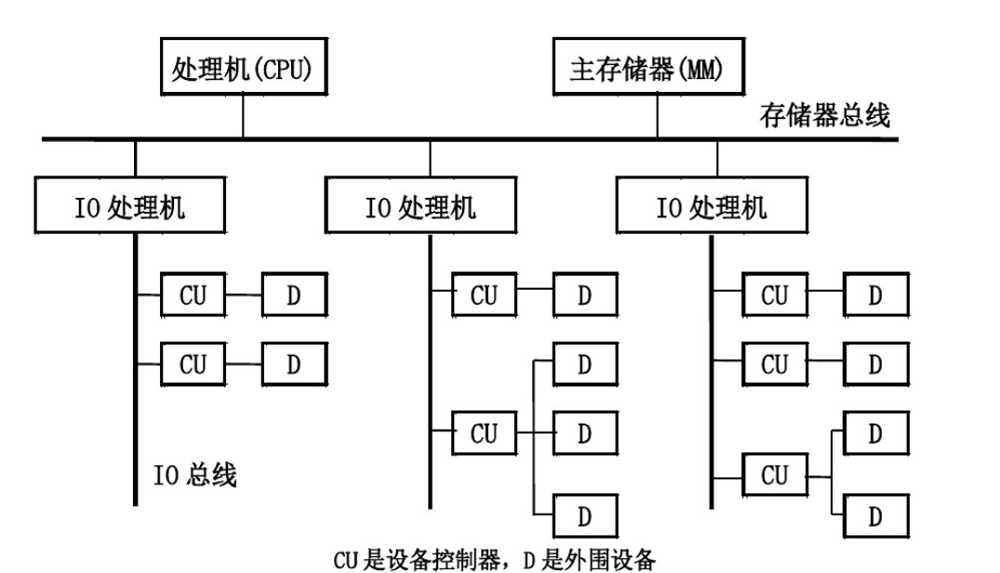

> # 输入输出系统
> 处理机与外部世界进行交往或通信的各种手段\
> 处理机和主存储器之外的部分称为输入输出系统\
> 包括输入输出设备，输入输出接口，输入输出软件等
# 输入输出原理
1. 输入输出系统的特点
   1. 异步性  ===> __自治控制__ 
      - 输入输出设备的工作在很大程度上独立于处理机之外，通常不使用统一的中央时钟，各个设备按照自己的时钟工作，但在某些时刻接受处理机的控制
      - 处理机于外围设备之间，外围设备与外围设备之间能够并行工作
      - 一般采用中断输入输出方式或直接存储器存取（DMA）方式工作
   2. 实时性 ===> __层次结构__
      - 处理机必须按照不同设备所要求传送方式和传输速率不失时机地为设备提供服务
        > 错过服务时机可能会丢失数据，外围设备工作错误，在某些领域，可能造成人身伤害等
      - 处理机本身的硬件或软件错误，也必须及时给予处理
   3. 与设备无关性 ===> __分类处理__
      - 计算机系统为了能够适应各种外围设备的不同要求，规定了一些独立于具体设备的标准接口，凡是连接到同一标准接口的不同设备间的差异必须由设备本身的控制器通过软硬件进行填补
      - 处理机可以采用统一的硬件和软件对品种繁多的设备进行管理
   > 异步性、实时性、与设备无关性对输入输出系统组织起决定性的影响

2. 输入输出系统的组织方式
   1. 自治控制
      - 输入输出系统是一个独立于处理机之外的自治系统
      - 自治控制实际上是把设备的输入输出功能最大限度地从处理机中分离出来，由专门的设备控制器通过它自身的硬件和软件去完成
   2. 层次结构
      - 采用可编程序控制输入输出系统能比较好的适应各种不同设备的控制需要，赋予固定的硬件设备以很大的灵活性
      - 层次结构的组织方式
         - 靠近处理机和主存储器的最高层采用标准的控制功能
         - 中间层采用标准接口
         - 外围设备通过设备控制器与标准接口相连接

         
         > I/O处理机通常是一台小型的专用处理机，执行与输入输出操作有关的程序
   3. 分类组织
      - 按照工作速度分类
        - 面向字符的设备
          - 工作速度较低的机电类设备，如字符终端、打字机等
          - 通常只在启动、停止或已经准备好要发送或接受数据的情况下才要求CPU作短时间的服务
        - 面向数据块的设备
          - 工作速度较高的外围设备，如磁盘、磁带、光盘等
          - 对于高速设备的数据块传送请求，CPU必须及时响应并处理，否则有可能丢失数据

3. 基本输入输出方式
   1. 程序控制输入输出方式
   2. 中断输入输出方式
   3. 直接存储访问(DMA)方式