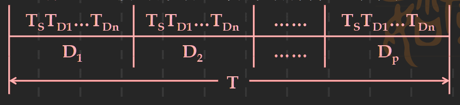

# 通道处理机
## 通道的作用和功能
- 在大型计算机系统，如果仅采用程序控制，中断和DMA三种基本的输入输出方式管理方式会导致以下两个问题
  - 所有外围设备的输入输出工作全部都要由CPU来承担，CPU的输入输出负担很重，不能专心用户程序的计算
  - 大型计算机系统中的外围设备台数很多，但是一般不同时工作。即如果为每台设备都设置一个接口，是一种浪费

- **通道处理机的作用：使CPU摆脱繁重的输入输出负担和共享输入输出接口**

- 输入输出系统的四级层次结构
  - CPU ==> 通道处理机 ==> 设备控制器 ==> 外围设备

- 通道的功能：
  - 接受CPU发来的输入输出指令，根据指令选择一台指定的外围设备与通道相连
  - 执行CPU为通道组织的通道程序，从主存中取出通道指令，对通道指令进行译码，并根据需要向被选中的设备控制器发出各种操作命令
  - 给出外围设备的有关地址，即进行读/写操作的数据所在的位置
  - 给出主存缓冲区的首地址，这个缓冲区用来暂时存放从外围设备上输入的数据或者暂时存放将要输出到外围设备中去的数据
  - 控制外围设备与主存缓冲区之间数据交换个数，对交换的数据个数进行计数，并判断数据传送工作是否结束
  - 指定传送工作结束时要进行的操作
  - 检查外围设备的工作状态（正常或故障），并将设备的状态信息送往主存指定单元保存
  - 在数据传输过程中完成必要的格式变换

- 通道的硬件
  - 寄存器部分
    - 数据缓冲寄存器
    - 主存地址计数器
    - 传输字节数计数器
    - 通道命令字寄存器
    - 通道状态字寄存器
  - 控制部分
    - 分时控制
    - 地址分配
    - 数据传送
    - 数据装配和拆卸等控制逻辑

- 通道与设备控制器间采用标准的输入输出接口连接
  
## 通道的工作过程
 

1. 在用户程序中使用访管指令进入管理程序，由CPU通过管理程序组织一个通道程序，并启动通道
    - 通道程序存放在主存储器中与这个通道相对应的通道缓冲区中
    - 在多任务或多用户系统中，输入输出指令属于特权指令    
2. 通道处理机执行CPU为它组织的通道程序，完成指定的数据输入输出工作
3. 通道程序结束后向CPU发中断请求。CPU响应中断请求后，第二次进入操作系统，调用管理程序对输入输出中断请求进行处理
   - 正常结束：管理程序进行必要的登记工作
   - 出现故障，错误等异常情况，则进行例外情况处理

## 通道的种类

#### 字节多路通道
- 一种简单的共享通道，主要为多台低速或中速的外围设备服务
- 采用分时方式工作
- 工作方式：字节交叉方式和成组方式（工作方式根据超时机制进行自动转换）
- 组织结构：
  - 控制部分公共，由所有子通道共享
  - 寄存器部分每个子通道都有自己独立的一套 ==> 可在主存储器开辟固定区域来充当
    
  

#### 选择通道
- 高速外围设备必须设置专门的通道在一段时间内单独为一台设备服务，在不同时间内可以选择不同的设备
- 选择通道：一旦选中某一设备，通道就进入‘忙’状态，直到该设备的数据传输工作全部结束为止
- 组织结构：

    

#### 数据多路通道
- 数据多路通道：把字节多路通道和选择通道的特性结合起来
- 选择一个高速设备后传送一个数据块，并轮流为多台外围设备服务
- 解决选择通道存在的浪费问题（充分利用外围设备在准备数据的时间）
- 硬件比选择通道更复杂

## 通道中的数据传送过程
1. 字节多路通道的传输时间：<!-- $T_{BYTE} = (T_s + T_D) * P * n$ --> 
   - P为通道上的设备台数
    
2. 选择多路通道：<!-- $T_{SELETE} = (\frac{T_s}{n} + T_D) * P * n$ --> 
    
3. 数组多路通道：<!-- $T_{BLOCK} = (\frac{T_S}{k} + T_D) * P *n$ --> 
   

## 通道的流量分析
- 通道流量：通道吞吐量，数据传输率
- 指一个通道在数据传送期间，单位时间内能够传送的最大数据量。一般用字节个数表示
- 通道最大流量：一个通道在满负荷工作状态下的流量
  - <!-- $f_{MAX·BYTE} = \frac{p·n}{(T_S + T_D)·p·n} = \frac{1}{T_S + T_D}$ --> 
  - <!-- $f_{MAX · SELETE} = \frac{p·n}{(\frac{T_S}{n} + T_D)p·n} = \frac{1}{\frac{T_S}{n} + T_D}$ --> 
  - <!-- $f_{MAX·BLOCK} = \frac{p·n}{(\frac{T_S}{k} + T_D)p·n} = \frac{1}{\frac{T_S}{k} + T_D}$ --> 
- 通道的实际流量:
  - <!-- $f_{BYTE} = \sum_{i=1}^{p} fi$ --> 
  - <!-- $f_{SELETE} = \max_{i=1}^{p} fi$ --> 
  - <!-- $f_{BLOCK} = \max_{i=1}^{p} fi$ --> 
- 通道实际流量越趋近于通道最大流量，通道的利用率就越高，但也容易造成数据丢失
  - 解决数据丢失方法：
    - 增加通道的最大流量
    - 动态改表设备的优先级
    - 增加一定数量的数据缓冲器，特别是对优先级比较低的设备

 

