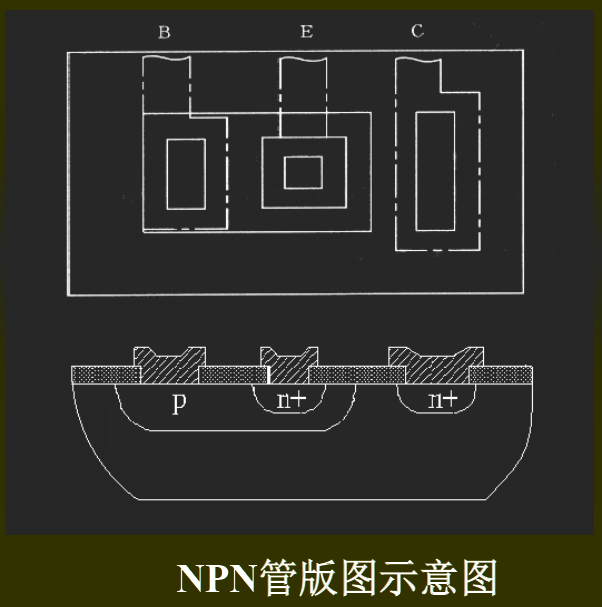

# IC版图设计
## 版图概述
- 定义：版图是集成电路设计者将设计并模拟、优化后的电路转化成一系列几何图形。它包含了集成电路尺寸大小、各层拓扑定义等器件相关的物理信息
- 作用：集成电路厂家根据版图信息制造掩模，设计走向制造的桥梁
- 设计规则：
  - 器件和物理特性和工艺的限制使得芯片的物理尺寸和版图设计必须遵守特定的规则
  - 设计规则是厂家根据本身工艺特点和技术水平所制定的
  - 不同的工艺，就有不同的设计规则
  - **设计规则是版图设计和工艺之间的接口**
## 版图几何设计原则
- 描述方法：
  - 微米规则：以微米为分别单位
  - $\lambda$规则：以特征尺寸为基准，通常以特征尺寸的一般为基准
- 具体内容：各层之间的最小宽度，层与层之间的最小间距和最小交叠等
- 层次：
    |||
  |:---:|:---:|
  |NWELL|n阱层|
  |Locos|有源区|
  |Poly|多晶硅层|
  |Contact|接触孔层|
  |Metal|金属层|
  |Pad|焊盘钝化层|
- 需要特别注意的问题
  - P阱层的 规则1.4
  - 多晶硅层的 规则3.4
  - 接触时采用分离式接触孔结构，而不采用合并式接触长孔的结构
## 电学设计原则
_几何设计规则是图形编辑的依据，电学设计规则是分析计算的依据_
* 布线规则：
  * 电源线和地线应尽可能地避免用扩散区和多晶硅区走线
  * 多采用梳妆走线，避免交叉
  * 禁止在一条铝走线的长信号线下平行走过另一条用多晶硅或扩散区走线的长信号线
  * 压点离开芯片内部图形的距离不应少于20um
  * 布线层选择时应考虑寄生电容和寄生电阻
## 晶体管的版图设计
- BJT版图设计\
  
- 划分隔离区的原则：电位要求不同，寄生PN结反偏
- 几何对称设计
- 热对称设计
---
_第三章ppt后几页_

