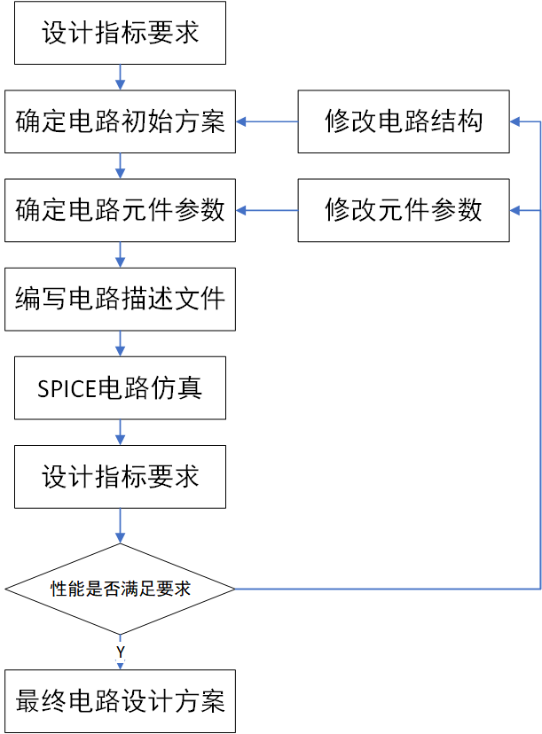

# 模拟程序SPICE
## 电路模拟与SPICE
* 对设计电路的验证
  * 传统方法 ------> 搭实验装置
    * 无法搭建集成度高，规模大的电路
    * 和实际集成电路差别太大
    * 无法进行容差分析和极限条件的验证
    
  * 用电路模拟分析的方法在计算机上验证
    * 不需要借助任何实际的元器件和调试工具
    * 可以进行破坏性模拟
    * 预测电路的实际性能
 
* SPICE电路模拟程序
  * 主要用于对元件、半导体器件、电源等组成的电路作分析
  * 可进行电路的直流分析、交流小信号分析、瞬态分析、温度特性分析等
  * 设计流程
  
    

## 电路描述语句
* SPICE输入描述语句的构成
  * 标题语句：文件第一行
  * 注释语句：* 后加字符串
  * 电路描述语句：定义电路拓扑结构和元件类型及其数值，半导体器件，电路描述语句等
  * 电路特性分析和控制语句：对电路的特性进行选择分析
  * 结束语句：.END(S)
* SPICES输入语句的规定：
  * 名称：描述元件时第一个字符必须是规定的元件类型字母；前8个字符有效
  * 节点编号：一般为正整数，可以不连续；接地点必须规定为0节点
  * 元素参数值：
    - 比例因子：
    <!-- $f=1e-15;\ p=1e-12;\ n=1e-9;\ u=1e-6;\ MIL=25.4e-6;$ --> 
    <!-- $m=1e-3;\ k=1e3;\ MEG=1e6;\ g=1e9;\ T=1e12$ --> 
    - 后缀单位：V; A; HZ; OHM(欧姆); H(亨); F(法); DEG(度)

    ---
    _eg: R1 1 2 5K ==> 名称：R1；两个节点：节点1和节点2；5k欧姆_
    - SPICE中元件名称的首字母

    |首字母|电路元器件|首字母|电路元器件|
    |:----:|:-------:|:----:|:-------:|
    |B|砷化镓场效应管|L|电感|
    |C|电容|M|MOS场效应晶体管|
    |D|二极管|Q|双极型晶体管|
    |E|电压控制电压源|R|电阻|
    |F|电流控制电流源|S|电压控制开关|
    |G|电压控制电流源|T|传输线|
    |H|电流控制电压源|V|独立电压源|
    |I|独立电流源|W|电流控制开关|
    |J|结型场效应管|X|子电路|
    |K|互感(耦合系数)||

  * 分隔符：区分一行，包括空格、逗号、等号、左括号、右括号等
  * 续行号：第二行最前面加上“+” 
  * 方向：规定支路电流的正方向和支路电压的正方向一致
  * 不能分析的语句：电压源回路、电感回路、电压源和电感组成的回路、开路的电流源和（或电容）

* 元件描述语句
  * 电阻：RXXX N+ N- <(MODEL) NAME> VALUE <TC=TC1,TC2>
  * 电容：CXXX N+ N- <(MODEL) NAME> VALUE <IC = INCOND>
  * 电感：LXXX N+ N- <(MODEL) NAME> VALUE <IC = INCOND>
  > * <TC=TC1,TC2> 表示一级温度系数和二级温度系数
  > * <IC = INCOND> 表示瞬态分析的初始条件
  * 二极管：DXXX N+ N- MODELNAME \<AREA> \<OFF> \<IC=VD>
  * BJT： QXXX NC NB NE \<NS> MODELNAME \<AREA> \<OFF> \<IC = VBE, VCE>
  * MOS： MXXX ND NG NS NB MODELNAME \<L=VAL>\<W=VAL>\<AD=VAL>\<AS=VAL>\<PD=VAL>\<PS=VAL>\<NRD=VAL>\<NRS=VAL>\<OFF>\<IC=VDS, VGS>
  * 独立电压源：VXXX N+ N- \<\<DC> DC/TRAN VALUE> \<AC \<ACMAG \<ACPHASE>>>
  * 独立电流源：IXXX N+ N- \<\<DC> DC/TRAN VALUE> \<AC \<ACMAG \<ACPHASE>>>
  * 直流源：VXXX/IXXX N+ N- \<DC> VALUE
  * 交流源：VXXX/IXXX N+ N- AC<ACMAG (ACPHASE)>
## 电路特性分析和控制语句
## 基本的SPICE核的工具软件
