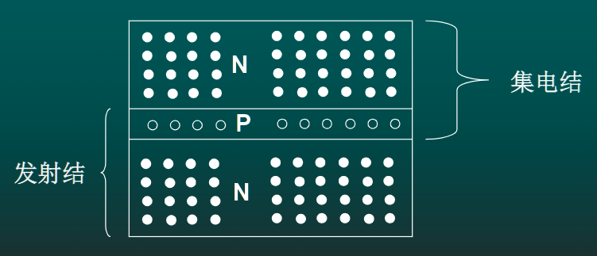

# 集成电路材料与器件物理基础
## 1. 集成电路材料
|分类|材料|电导率（S/cm）|
|:--:|:--:|:-----------:|
|导体|铝、金、钨、铜等；镍铬等合金；重参杂多晶硅|~105|
|半导体|硅、锗、砷化镓、磷化铟、氮化镓|10-9~102|
|绝缘体|SiO2、Si3N4、HfO2、Al2O3|10-22~10-14|
## 2. PN结及结型二极管
- PN结 ---- 多数半导体器件的核心单元
  - 根据杂质浓度划分：突变结和线形缓变结
  - 根据结两边半导体材料不同划分：同质PN结和异质PN结
- 平衡态下的PN结：\
    
- 理想PN结二极管的电流方程:<!-- $I_D=I_S(e^{qV_D/kT}-1)$ --> 
- 基本应用：整流；电流隔离
- 肖特基接触：指金属和半导体材料相接触的时候，在界面处半导体的能带弯曲，形成肖特基势垒。该势垒的存在才导致了大的界面电阻
  > 具有肖特基接触的金属与半导体界面形成**结二极管**
- 欧姆接触：指金属与半导体材料相接触，其接触电阻值远小于半导体本身的电阻。
  > 当金属作为半导体器件的**电极**时，必须要求欧姆接触\
  > 良好的欧姆接触，需要结区势垒较低，可以通过半导体高掺杂实现
## 3. 双极型晶体管
- 工作状态：
  

   
  
  

  - 发射结正偏，集电结反偏时 ====> 放大工作状态
  - 发射结正偏，集电结正偏时 ====> 饱和工作状态
  - 发射结反偏，集电结反偏时 ====> 截至工作状态
  - 发射结反偏，集电结正偏时 ====> 反向工作状态
## 4. MOS晶体管
_场效应晶体管（FET)_\
_结型场效应晶体管（JFET），三端子半导体器件_\
_金属-氧化物-半导体场效应管（MOSFET），四端子半导体器件_
_互补性金属-氧化物-半导体器件（CMOS）_
- 类型：
  - 常开型：耗尽型晶体管
  - 常关型：增强型晶体管
- 输出特性：详见模集，数集
## 5. MESFET
- 和JFET类型，但是用肖特基结代替PN结
